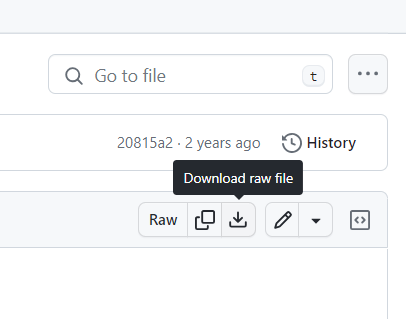

# README

## 如何下载

- 官方群群文件

- Github上的 [仓库](https://github.com/sealdice/draw)

如何下载：

牌堆全部放在 sealdice_draw 目录下，选择一个文件，右上角的有下载按钮。

## 编辑牌堆

请参照文档：[编辑牌堆](https://docs.sealdice.com/advanced/edit_deck.html#%E6%A6%82%E8%A7%88)
